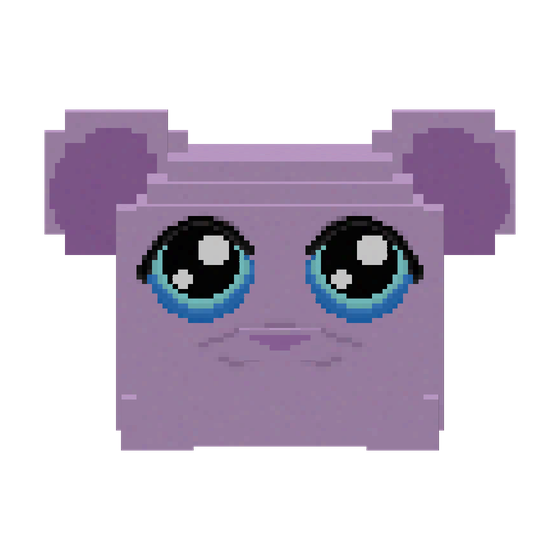

<p align="center"></p>

<h1 align="center">Guhs</h1>

<p align="center"><i>Add sweet chonky guhs to Minecraft!</i></p>

<p align="center">
Minecraft 26.1.2 (Guhs 1.1.x and 1.2.x) and 1.21.1 (Guhs 1.0.x) · NeoForge · requires GeckoLib<br>
<a href="https://www.curseforge.com/minecraft/mc-mods/guhs">CurseForge</a> ·
<a href="https://modrinth.com/mod/guhs">Modrinth</a> ·
<a href="https://guhs.nl/">guhs.nl</a> ·
<a href="https://guhs.nl/wiki/">Wiki</a> ·
<a href="CHANGELOG.md">Changelog</a>
</p>

---

**Guhs** adds the *guh*: a chubby pink plush mouse that is very, very *chonky* (lovably chubby). Tame one with
Cheese Nibbles, dress it up, ride it, cuddle it until you are *soulguh bff 5evr <3*, and follow it
through a portal into the **Guhmension**, a whole pink world full of guhs, cheese, minigames and little stories.

Guhs are always friendly. Nothing in the mod makes them hurt you, and the one grumpy guh (Mika) only shoves.

> **Language:** since 1.2.0 every in-game name and text is in **English and Dutch**, with a lot of guh puns in both.
> *Auto* (the default) follows your Minecraft language (Dutch when Minecraft is in Dutch, English otherwise); pick
> **Auto / NL / EN** yourself: Guhs asks once when you first join a world or server, and later you switch with the
> *Lang* button under your Guhdex or *Guhs language* in the mod's config (`language` in `config/guhs-client.toml`).
> Per player, also on servers. The [wiki](https://guhs.nl/wiki/) is in
> English and Dutch too. (Guhs 1.0.x for Minecraft 1.21.1 is Dutch only.)

## Features

- **The guh.** Spawns in every overworld biome in random sizes (tiny to three blocks long). Tame it with Cheese
  Nibbles, pet it (a short right-click), name it, pick it up (sneak + right-click), ride big ones with a saddle, and
  hold right-click for the **guh menu**: sit, follow, behaviour, sounds, emotes, wardrobe, diary and more.
- **20+ guh variants** (Mint, Choco, Ghost, Starry, Rainbow, Golden, Pinguh, Ender guh you can fly, Merguh that
  swims, ...), each with a page in the **Guhdex**, your in-game collection book.
- **Hearts & friendship.** Every tamed guh has a heart meter with you, eight secret favourites to discover, friends
  among other guhs, chores it can do from its **Guh House** (a house shaped like a guh head), toys, and a diary.
- **Clothes.** More than 150 outfit pieces in seven slots (hats, glasses, ears, hair, jackets, backpacks...), each
  unlocked once from its own source and then wearable by all your guhs. Plus guh armour and a backpack.
- **The Guhmension.** Pink wool hills, cheese-sauce rivers, a pink moon, and many biomes: cozy Snuggledale,
  the icy Guh Polder, the tropical Guhwai'i, a snowy tundra, deep guh seas, cheese caves, a cheese swamp and giant
  guh forests.
- **Places to find.** Hamster-house playsets, guh villages with guh villagers and guh professions, a 128x128 guh
  theme park, a gothic guh castle with a King Guh on the throne, a guh fair with a real sled coaster, floating
  islands, a pink pyramid, cheese fountains and much more. A **Super Compass** points the way.
- **Minigames.** More than twenty of them, each in its own building with its own guh host, coins, shop, outfit and
  world top-3 boards: guh race, golf, disco, fishing, shuffleboard, a hedge maze, a catapult, a skating tour past eleven
  villages, a kart circuit, surfing, hula, baking, hairdressing and more.
- **Stories.** Story questlines with their own characters, talking screens with answers, a short camera scene at
  their biggest moment, and a special story guh to tame at the end (a medicine sled ride through a snowstorm, a
  clone-island lab, a chapel in the clouds that brings lost guhs back, and a tropical *ohana* island).
- **Sniff Island.** Your little brother or sister is ill, so you sail after Papa to find the healing flower, wash
  ashore on an island and wake up as a dog. Pick your breed, coat and buddy (a forest sprite only you can see), learn to
  sniff with a scent meter, help the dogs of Sniffville and earn your diploma as a Sniff Pup, rank 1 of 5. Your own
  things wait safely at home, and the Guhstation takes you back whenever you like.
- **The Guh Path.** The big stories open the worlds: follow the five stories of the Guhmension and Guhdalf begins the
  Nibble Ring and the grill portal lets you into the Guhbarbecuether; the Nibble Ring, Super Guhrio and the Burnt Mika
  open the Guh End. A path map in the Guhdex and *My Story* on the Super Compass always show what comes next.
- **The Lord of the Nibble Ring.** The big story of the Guh Barbecuether: a ring-shaped nibble that makes everyone
  greedy has to go to Mount Fry, not to be destroyed but to be fried and shared. Six chapters with real camera scenes,
  a Journey Map in the Guhdex, an objective on screen, and Sam-guh who walks with you the whole way. The Eye, the Nine
  and everything else on the road only shove you back to your last rest fire.
- **Super Guhrio.** A castle in the sauce sea with six levels played in side view (A/D, jump, pipes, flags, coins,
  secrets, time records), Guhshi to ride, and a duel at the end. No lives: a fall puts you back at your last flag.
- **The Guh Barbecuether's buildings.** Thirteen buildings, each with somebody who has a short questline for every
  player: a fossil dig, a salt crystal mine, a lighthouse, a pepper garden, a campground, a barter market, the Mika
  Apartments, a Sauce Strider stable and more. New creatures: the Sauce Strider, the Sauce Blubby, the Sausage Piglet.
- **Guh Technology.** Guhs make **chonk power** (running in a Guh Wheel, cuddling on a Cuddle Generator, dancing on a
  Disco Dynamo) and guh machines use it: see-through Nibble Tubes with filters, sauce pumps and hoses, a Harvester, a
  Nibbler, a Placer, a Tinker Machine for auto-crafting, a Plantation Box, sensors, and the Delivery Guhling on its
  scooter. Every machine has a snoot that shows how it is doing. The quest book teaches it in projects.
  Tubes and hoppers can always put things into a Bank Guh; only a Nibble Tube with a Filter Piece takes them out
  again, and only from a bank with its upgrade.
- **Three extra dimensions.** Your own **Guhbelly** (a pocket dimension inside a giant guh), the fiery
  **Guhbarbecuether** and the endgame **Guh End**, where Overlord Mika has stolen every cheese nibble in the kingdom.
- **Little critters.** Squeaksqueak mice, plush turtles, birds, ducklings, bunnies, hedgehogs, squirrels, axolotl
  guhs and more, most of them tameable.
- **Useful blocks.** The **Bank Guh** (storage for every kind of item with search and a crafting grid: 256 of each
  kind, more with its upgrade), the **Nom Hatch** that puts things into your bank from anywhere, the frying pan, sled
  rails, furniture, food and lots of decoration blocks.
- **FTB Quests support.** If FTB Quests is installed, two chapter groups install themselves (more than 1,100 quests,
  in English and Dutch): *Guhs* with everything there is to do, and *The Guh Path* with the big stories in order. Each
  chapter of The Guh Path starts with a lock quest that shows which stories to follow first.

Everything is explained, with pictures, in the **[Guhs wiki](https://guhs.nl/wiki/)**.

## Requirements

Guhs comes in two lines. Pick the one that matches your Minecraft version (1.2.x adds the English translation; the
1.0.x line has the same content, in Dutch only):

| | **Guhs 1.2.x / 1.1.x** (new) | **Guhs 1.0.x** |
|---|---|---|
| Minecraft | **26.1.2** | **1.21.1** |
| Loader | **NeoForge** 26.1.2.71 or newer | **NeoForge** 21.1.0 or newer |
| Required | **[GeckoLib](https://modrinth.com/mod/geckolib)** 5.5.2 or newer | **[GeckoLib](https://modrinth.com/mod/geckolib)** 4.8 or newer |
| Java | 25 | 21 |
| Git branch | `mc26` | `main` |

| | |
|---|---|
| Optional | FTB Quests (adds the Guhs quest chapters), JEI, Jade |
| Recommended for servers | **[Lootr](https://modrinth.com/mod/lootr)**: every player gets their own loot from structure chests |

Install Guhs on **both** the server and every client. A world opened with 1.1.x (Minecraft 26.1.2) can't go back to
1.0.x, so make a backup first.

## Installing

1. Install NeoForge for Minecraft 26.1.2 (or make a NeoForge 26.1.2 instance in Prism Launcher, the CurseForge app
   or the Modrinth app). On Minecraft 1.21.1, use Guhs 1.0.x instead.
2. Put `guhs-1.2.0.jar` (or `guhs-1.0.x.jar` on 1.21.1) and the matching GeckoLib in the `mods` folder (launchers can
   download both for you).
3. Start the game and make a **new world**. Find a guh, give it Cheese Nibbles, and enjoy.

Want everything ready to go? Try the **Guhs Pack** modpack (Guhs + GeckoLib, JEI, Jade, JourneyMap, AppleSkin,
Mouse Tweaks, Lootr and FTB Quests).

## Modpacks and videos

You may put Guhs in any modpack and make videos or streams about it (monetised is fine). You may not re-upload it
on its own. See [LICENSE](LICENSE).

## Building from source

Branch `mc26` (Guhs 1.1.x and 1.2.x, Minecraft 26.1.2) needs a **JDK 25** (Gradle downloads it for the build if it is missing);
branch `main` (Guhs 1.0.x, Minecraft 1.21.1) needs a **JDK 21**.

```sh
./gradlew build              # -> build/libs/guhs-<version>.jar
./gradlew runClient          # a dev Minecraft with the mod
./gradlew runGameTestServer  # the automated in-game tests (headless)
```

The generators for models, textures, sounds, structures, FTB quests and the wiki live in `tools/` (Python 3.10+,
`pip install -r tools/requirements-wiki.txt`). Run them from the project root. The Blockbench model sources are in
`blockbench/`.

## Credits

- **Guh model:** Lieke (the original Blockbench guh).
- **Everything else** (code, sounds, music, textures, structures, stories): Juiced.
- Built with [NeoForge](https://neoforged.net/) and [GeckoLib](https://github.com/bernie-g/geckolib).

Guhs is a fan-made mod and is not affiliated with Mojang or Microsoft. The stories are affectionate parodies; the
names and characters they poke fun at belong to their owners.

---

## Nederlands

**Guhs** voegt de *guh* toe: een mollig roze knuffelmuisje dat heel erg *vadsig* is. Tem hem met kaasknabbels, kleed
hem aan, rij op hem, knuffel hem tot jullie *zielsguh bff 5evr <3* zijn, en volg hem door een portaal naar de
**Guhmensie**: een hele roze wereld vol guhs, kaas, minigames en verhaaltjes. Guhs zijn altijd lief.

**Wat zit erin?**
- De guh: tem, aai (kort rechtsklikken), noem, pak op, rij, en open het guhmenu (rechtsklik ingedrukt houden).
- Meer dan 20 guh-varianten en de **Guhdex** om ze te verzamelen.
- Een hartjesmeter per guh, geheime favorietjes, vriendjes, klusjes vanuit je **guhhuisje**, speelgoed en een dagboekje.
- Meer dan 150 kledingstukjes in zeven vakjes, guh-harnas en een rugzak.
- De **Guhmensie** met veel biomen: Knuffeldal, Guhpolder, Guhwai'i, de sneeuwtoendra, diepe guhzeeën, kaasgrotten en meer.
- Gebouwen om te ontdekken: hamsterhuizen, guhdorpen met guh-dorpelingen, het pretpark Guhland, een guhkasteel, een kermis met achtbaan, zwevende eilanden en veel meer, met een **superkompas**.
- Meer dan twintig **minigames**, elk met een eigen gebouw, gastguh, munten, winkel, pakje en top-3-borden.
- **Verhalen** met personages, gesprekken met antwoordknoppen, een kort filmpje op hun grootste moment en een bijzondere
  verhaalguh als beloning.
- **Het Snuffeleiland**: je broertje of zusje is ziek, dus vaar je papa achterna om de geneesbloem te zoeken, spoel je aan op
  een eiland en word je wakker als hond. Kies je ras, je vacht en je maatje (een bosgeestje dat alleen jij ziet), leer
  snuffelen met de geurmeter, help de honden van Snuffeldorp en haal je diploma als Snuffelpup, rang 1 van 5. Je eigen
  spullen wachten veilig thuis, en met het Guhstation ga je terug wanneer je wilt.
- **Het Guhpad**: de grote verhalen openen de werelden. Volg de vijf verhalen van de Guhmensie en Guhdalf begint met de
  Knabbelring en het grillportaal laat je door naar de Guhbarbecuether; de Knabbelring, Super Guhrio en de Aangebrande
  Mika openen het Guheinde. De padkaart in de Guhdex en *Mijn verhaal* op het superkompas wijzen steeds de weg.
- **In de ban van de Knabbelring**: het grote verhaal van de Guhbarbecuether. Een ringvormige knabbel moet naar de Frituurberg,
  niet om hem te vernietigen maar om hem te frituren en te delen. Zes hoofdstukken met echte filmpjes, een reiskaart in de
  Guhdex en Sam-guh die de hele weg meeloopt. Niemand doet je pijn: wie gezien wordt, staat weer bij zijn laatste rustvuurtje.
- **Super Guhrio**: een kasteel in de sauszee met zes levels van opzij, Guhshi om op te rijden en een duel aan het eind.
- Dertien **gebouwen in de Guhbarbecuether** met elk een eigen questlijn (voor iedere speler), en nieuwe wezens: de Sausloper,
  het Sausblubje en het Worstzwijntje.
- **Guh-technologie**: guhs maken **vadskracht** (in een Guhrad, op een Knuffelgenerator, op een Disco-dynamo) en guhmachines
  gebruiken het: Knabbelbuizen met filters, sauspompen en slangen, een Oogster, een Knabbelaar, een Knutselmachine, een
  Plantagebak, sensoren en het Bezorgguhtje op zijn stepje. Elke machine heeft een snoet die laat zien hoe het gaat.
  Buizen en trechters kunnen altijd spullen in een Bankguh stoppen; eruit halen kan alleen een Knabbelbuis met een
  Filterstuk, en alleen uit een bank met zijn upgrade.
- Drie extra dimensies: je eigen **Guhmaag**, de **Guhbarbecuether** en het **Guheinde** met Opper-Mika.
- Diertjes: pieppiepmuisjes, knuffelschildpadjes, vogeltjes, eendjes, konijntjes, egeltjes en meer.
- Handige blokken: de **Bankguh** (opslag voor alles, 256 van elke soort en meer met zijn upgrade), het **Hapluikje** dat van
  overal spullen in je bank stopt, de frituurpan, sledebanen en meubels.
- **FTB Quests**: is het geïnstalleerd, dan komen er vanzelf twee groepen bij (meer dan 1100 quests): *Guhs* met alles wat
  er te doen is, en *Het Guhpad* met de grote verhalen op volgorde, elk hoofdstuk met een slotquest die laat zien welke
  verhalen je eerst nog moet volgen.
- De **officiële Guhs-server** `guhs.nl` (dag en nacht aan). Zo speel je mee: [Speel op de officiële server](https://guhs.nl/wiki/server.html).

**Nodig:** Guhs 1.1.x en 1.2.x: Minecraft 26.1.2, NeoForge 26.1.2.71+, GeckoLib 5.5.2+ (Java 25). Guhs 1.0.x: Minecraft 1.21.1,
NeoForge 21.1.0+, GeckoLib 4.8+. Installeer Guhs op de server én bij elke speler.
Alle teksten in het spel zijn er in het Nederlands en het Engels (sinds 1.2.0; Guhs 1.0.x is alleen Nederlands):
*Auto* volgt de taal van Minecraft. Guhs vraagt het één keer als je voor het eerst een wereld of server binnenkomt;
daarna wissel je met de knop *Taal* onder je Guhdex of `language` in `config/guhs-client.toml` (Auto, NL of EN). **Aanrader voor servers:** Lootr, zodat elke speler zijn eigen buit uit
kisten krijgt.

**Modpacks en video's:** je mag Guhs in elk modpack stoppen en er (ook betaalde) video's en streams over maken. Los
opnieuw uploaden mag niet. Zie [LICENSE](LICENSE).

**Met dank aan:** Lieke voor het guh-model. Al het andere (code, geluidjes, muziek, gebouwen, verhalen): Juiced.

Alles staat met plaatjes in de **[Guhs-wiki](https://guhs.nl/wiki/)**.
